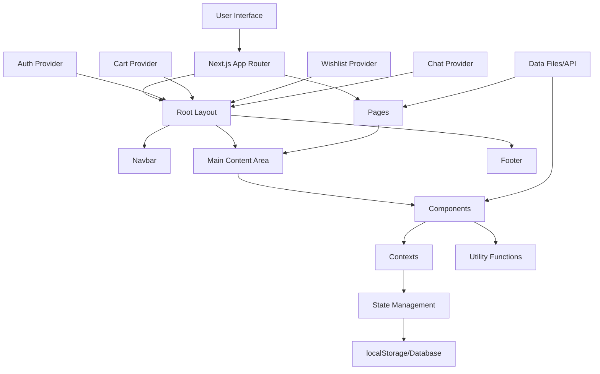

# AzniT System Patterns

## System Architecture

### Overview
AzniT is built as a modern e-commerce application using Next.js 14 with App Router for server and client components. The project follows a component-based architecture with a clean separation of concerns between UI, data, and business logic.

### Key Components

1. **Frontend Layer**
   - Next.js App Router for page routing and layouts
   - React components for UI elements
   - TailwindCSS for styling
   - Context API for state management (cart, auth, wishlist, chat)

2. **Backend Layer**
   - API Routes for server-side operations
   - NextAuth.js for authentication
   - Prisma ORM for database operations

3. **Data Layer**
   - SQLite for development (migrating to PostgreSQL for production)
   - Prisma as ORM
   - Data models for Users, Products, Orders, and Reviews

## Design Patterns

### Component Structure
- Reusable UI components stored in `/components`
- Page-specific components defined within page files
- Layout components for consistent UI structure

### State Management
- React Context for global state (shopping cart, authentication, wishlist, chat)
- Local component state for UI-specific state
- Server state managed through API calls

### Data Fetching
- Server Components for initial data loading
- Client Components for interactive data loading
- API routes for data mutations

## Authentication System

Authentication is implemented using NextAuth.js with the following features:
- Email/password authentication
- Session management via secure HTTP-only cookies
- Role-based access control (User vs Admin)
- Protected routes via middleware

### Auth Flow
1. User submits login credentials
2. Server validates credentials and creates a session
3. Session token stored in cookies
4. Middleware checks session for protected routes
5. User/Admin access determined by role field in user record

## Shopping Cart System

The shopping cart is implemented using React Context and localStorage:
- Cart state managed through CartContext
- Cart persistence through localStorage
- Add/remove/update cart items through context methods
- Cart summary calculations (totals, discounts)

### Cart Flow
1. User adds product to cart
2. Cart context updates state and localStorage
3. Cart UI reflects updated cart
4. Cart state persists between sessions
5. Cart data submitted during checkout

## Wishlist System

The wishlist functionality allows users to save products they're interested in for future reference:
- Wishlist state managed through WishlistContext
- Wishlist persistence through localStorage 
- Add/remove wishlist items through context methods
- Toggle functionality for adding/removing items

### Wishlist Flow
1. User clicks "Add to Wishlist" on a product
2. WishlistContext updates state and localStorage
3. Wishlist UI reflects updated items
4. Wishlist state persists between sessions
5. User can view all wishlist items in a dedicated section
6. Items can be moved from wishlist to cart

### Wishlist Components
- `WishlistButton`: Toggle button for adding/removing items from wishlist
- `WishlistPage`: Page displaying all wishlist items
- `WishlistItem`: Component for displaying individual wishlist items
- `EmptyWishlist`: Component shown when wishlist is empty

## Chat Support System

The chat support system provides real-time communication between customers and support:
- Chat state managed through ChatContext
- Real-time messaging functionality
- Minimized/expanded UI states
- Message history management

### Chat Flow
1. User opens chat widget from floating button
2. Chat interface expands to show conversation
3. User enters messages to communicate with support
4. Support responds in real-time
5. Chat can be minimized while browsing the site
6. Conversation history maintained during session

### Chat Components
- `ChatWidget`: Floating chat button and expanded chat interface
- `ChatMessage`: Individual message component
- `ChatInput`: Text input for sending messages
- `ChatHeader`: Header with minimize/close controls

## Product Management

Products are managed through a structured approach:
- Product data model with comprehensive fields
- Categories for product organization
- Image management for product visuals
- Integration with inventory and pricing

### Product Display Flow
1. Products fetched from database
2. Product listings displayed with filtering options
3. Product details shown on individual pages
4. Related products suggested based on category

## Checkout System

The checkout process follows a multi-step approach:
- Address collection
- Shipping method selection
- Payment processing
- Order confirmation

### Checkout Flow
1. User reviews cart
2. User provides shipping details
3. User selects payment method
4. Payment processed through PayPal
5. Order created in database
6. Confirmation displayed to user

## Review System

The review system allows customers to share their experiences with products:
- Star ratings (1-5 scale)
- Written reviews
- Review moderation
- User authentication required

### Review Flow
1. Authenticated user submits a review with rating
2. Review saved to database with pending status
3. Admin moderates reviews through admin interface
4. Approved reviews displayed on product pages
5. Average ratings calculated and displayed

### Review Components
- `ReviewForm`: Client component for submitting reviews
- `ReviewList`: Component for displaying reviews
- Admin review management interface
- Star rating visualization

### Review Data Model
- Connected to both User and Product models
- Stores rating, comment, approval status
- Timestamps for creation and updates

## Admin System

The admin system provides management capabilities:
- Product management (add, edit, delete)
- Order management (view, update status)
- User management (view, edit roles)
- Review moderation (approve, reject, delete)

### Admin Access Flow
1. User with admin role logs in
2. Middleware verifies admin status
3. Admin dashboard and features made available
4. Admin performs management tasks
5. Changes reflected in database

## Error Handling

The application uses a consistent approach to error handling:
- Client-side validation for form inputs
- Server-side validation for data integrity
- Descriptive error messages for users
- Graceful fallbacks for failed operations
- Error boundaries for component failures

## Data Flow

The overall data flow in the application follows these patterns:
1. UI components trigger actions
2. Actions processed by context or API calls
3. Data stored in database through Prisma
4. UI updated to reflect changes
5. Optimistic updates used where appropriate

## Architecture Overview



## Directory Structure
- **app/**: Contains page components and layouts using Next.js App Router
  - **page.tsx**: Home page
  - **layout.tsx**: Root layout with navigation and footer
  - **about/**: About page
  - **products/**: Product listing and details pages
  - **cart/**: Shopping cart page
  - **checkout/**: Checkout flow
  - **contact/**: Contact page
  - **admin/**: Admin dashboard
  - **account/**: User account pages
  - **register/**: User registration
  - **login/**: Authentication pages
  - **api/**: API routes
- **components/**: Reusable UI components
  - **layout/**: Layout components (Navbar, Footer)
  - **product/**: Product-related components
  - **cart/**: Cart-related components
  - **ui/**: Generic UI components
  - **auth/**: Authentication components
  - **checkout/**: Checkout components
- **contexts/**: React Context providers
  - **CartContext.tsx**: Shopping cart state
  - **PayPalContext.tsx**: Payment processing
- **lib/**: Utility functions and data
- **public/**: Static assets
- **styles/**: Global CSS styles
- **types/**: TypeScript type definitions
- **prisma/**: Database schema and client

## Design Patterns

### Page Structure
- Single root layout that provides consistent chrome (navbar, footer)
- Each page handles its own content without wrapper components
- Avoids duplicate UI elements through centralized layout management

### Component Composition
- Components are built modularly, with smaller components combined to create complex UI
- Clear separation of concerns with each component having a single responsibility
- Props drilling is avoided by using Context API where appropriate

### Context API for State Management
- `CartContext` provides global cart state and functions
- `AuthProvider` wraps the application to provide authentication state
- `PayPalContext` manages payment processing functionality
- Standardized provider pattern with custom hooks for consuming context

### Data Flow
- One-way data flow from parent to child components
- Events bubble up through callback props
- Global state managed through Context API
- Server state managed using API routes and database

### Authentication
- NextAuth.js for secure authentication
- Route protection via middleware
- Role-based access control (admin vs regular users)

### Form Handling
- Form state managed with controlled components
- Validation handled both client-side and server-side
- Error messages displayed inline with form fields

### Responsive Design
- Mobile-first approach using Tailwind CSS
- Grid and Flexbox layouts for adaptive components
- Media queries for specific breakpoints

## Key Component Relationships

### Application Structure
```
RootLayout (app/layout.tsx)
├── AuthProvider
├── CartProvider
├── PayPalProvider
├── Navbar
├── Main Content (page-specific)
└── Footer
```

### Product Component Hierarchy
```
ProductsPage
├── FilterSidebar
├── ProductGrid
│   └── ProductCard (multiple)
└── Pagination
```

### Cart Component Hierarchy
```
CartPage
├── CartItemList
│   └── CartItem (multiple)
└── CartSummary
    ├── Subtotal
    ├── Shipping
    └── Total
```

### Checkout Flow
```
CheckoutPage
├── CheckoutSteps
├── ShippingForm (Step 1)
├── PaymentForm (Step 2)
│   └── PayPalPayment
└── OrderSummary
```

### Authentication Flow
```
AuthProvider
├── LoginPage
├── RegisterPage
└── Protected Routes (via middleware)
```

## Data Models

### User
```typescript
type User = {
  id: string;
  name: string;
  email: string;
  role: 'USER' | 'ADMIN';
  password: string; // Hashed
  createdAt: Date;
  updatedAt: Date;
};
```

### Product
```typescript
type Product = {
  id: string;
  name: string;
  description: string;
  price: number;
  images: string[];
  category: string;
  tags: string[];
  inStock: boolean;
  featured?: boolean;
  discount?: number;
  rating?: number;
  reviews?: number;
};
```

### CartItem
```typescript
interface CartItem {
  id: string;
  name: string;
  price: number;
  image: string;
  quantity: number;
  discount?: number;
}
```

### Order
```typescript
type Order = {
  id: string;
  userId: string;
  items: OrderItem[];
  total: number;
  status: 'PENDING' | 'PROCESSING' | 'SHIPPED' | 'DELIVERED';
  shippingAddress: Address;
  paymentId: string;
  createdAt: Date;
};
```

### WishlistItem
```typescript
interface WishlistItem {
  id: string;
  name: string;
  price: number;
  image: string;
  discount?: number;
  dateAdded: Date;
}
```

### ChatMessage
```typescript
type ChatMessage = {
  id: string;
  content: string;
  sender: 'user' | 'support';
  timestamp: Date;
  isRead: boolean;
};
```

## Interaction Patterns
- Click to add items to cart
- Click to add/remove items from wishlist
- Form submission for checkout process
- Authentication redirects for protected routes
- Filter sidebar for product discovery
- Modal dialogs for confirmations
- Toast notifications for action feedback
- Floating chat widget for customer support 